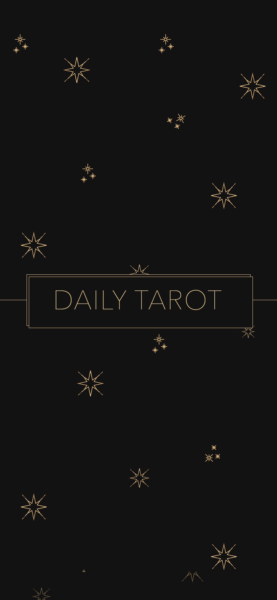
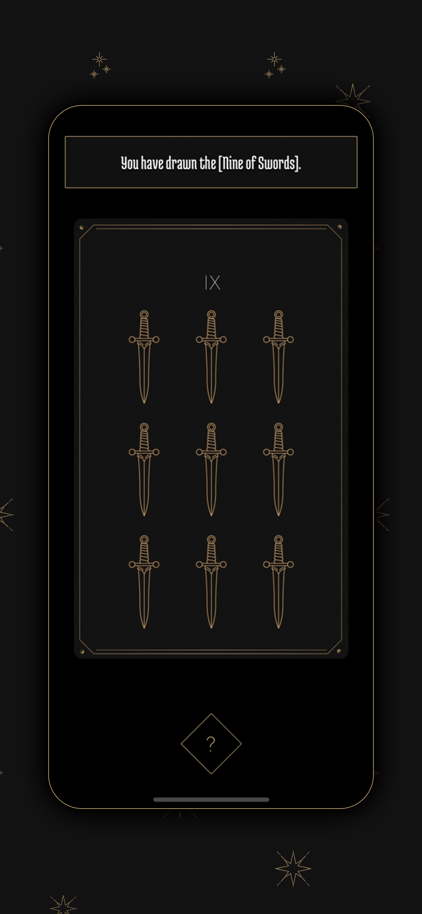
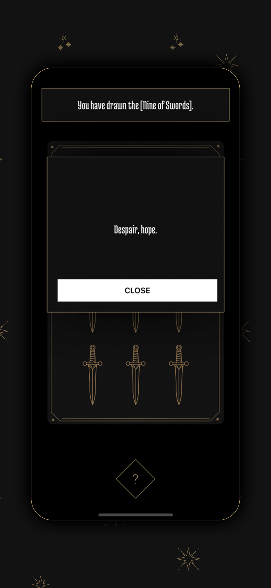
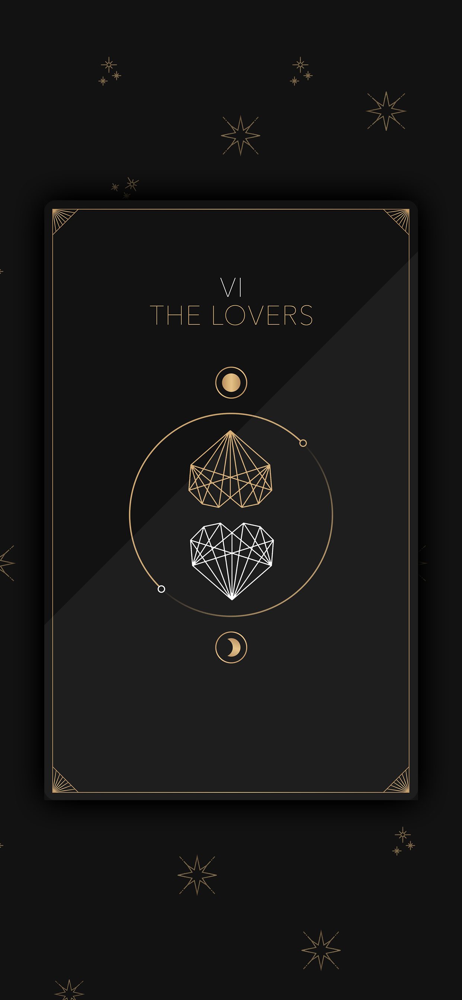

#### Try it on your iPhone with Expo:

##### [https://expo.io/@bennyschmidt/daily-tarot](https://expo.io/@bennyschmidt/daily-tarot)

-----

## From React Native to the App Store

### Daily Tarot for iPhone

Daily Tarot: One Card Draw is a simple app I designed and built over the weekend in React Native as a personal exploration in releasing and distributing iOS apps with Expo. In short, Expo provides a great developer experience that makes launching apps really easy.

This project can serve as a reference for developers who are working with Expo & React Native for the first time, or even as a foundation for someone who might be creating their own card game for iPhone. You are free to use and build upon this code however you want 👍

#### Built with React Native

<div style="display: flex">
  <div style="flex: 1">
    
  </div>
  <div style="flex: 1">
    
  </div>
</div>

<div style="display: flex">
  <div style="flex: 1">
    
  </div>
  <div style="flex: 1">
    
  </div>
</div>

### Development

#### 1. Run the app locally with Expo

```
yarn install && yarn start
```

#### 2. Scan the QR code

A QR code will appear in your terminal. Scan it using iOS Camera and your device will prompt you to open the app in Expo. Note: Install Expo on your device first.

### Distribution

#### 1. Build for iOS

```
expo build:ios
```

Building starts a [wizard-like build process](https://docs.expo.io/versions/latest/distribution/building-standalone-apps/#if-you-choose-to-build-for-ios) command line flow that requires you to authenticate your Expo account as well as your Apple Developer account (which is $99/year) – so make sure you have those. Expo automates a lot of the tedious work to prepare your app for distribution, which is nice.


#### 2. Upload your build

After completing the steps, you'll end up with an [Expo project](https://expo.io/@bennyschmidt/daily-tarot) that people can share around, and an iOS build uploaded to [App Store Connect](https://appstoreconnect.apple.com). When you login to App Store Connect, notice the "Submit For Review" button in the top-right.

#### 3. Submit for Approval

Before clicking that button, you can easily integrate TestFlight within App Store Connect if you want to invite users to a closed test to ensure everything works. When you're satisfied with the app and ready to launch to the masses, click the "Submit for Review" button and it's off to Apple for consideration on the App Store. Apple tends to be pretty strict in their review process about apps that aren't very unique or useful. With tarot being a rather saturated market, the app you actually submit might require more functionality than the one in this guide in order to get approved.

Now you know how to deploy your React Native app and distribute it on the App Store using Expo. Happy hacking and good luck!

More on React Native: [React Native Getting Started](https://facebook.github.io/react-native/docs/getting-started.html)

#### License

Code files are MIT.
Some creative assets have restrictions (see [src/assets/License.md](src/assets/License.md)).
